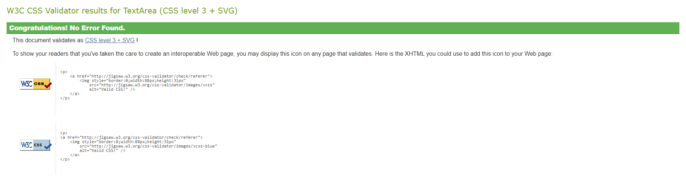

# Lowkey Menswear

This is a full-stack e-commerce project built using Django, Python, HTML, CSS and JavaScript.

Lowkey Menswear is a London based online apparel store which specialize in quality, hard-wearing clothing for an affordable price. 

The live link can be found here - [Lowkey Menswear](https://lowkey-menswear.herokuapp.com/)


# User Experience (UX)

Lowkey Menswear is a website for people aged between 18-35 to buy good quality essentials, basic's and statements pieces.

The target audience for 'Lowkey' are:
- 18 to 35 year olds
- People looking to avoid 'fast fashion'
- People looking for quality clothing

# User Stories 

#### EPIC | Navigation
- As a User I can navigate around the site so that I can easily view desired content.
- As a User, I can view a list of products so that I can choose what products to purchase.
- As a User, I can click on a product to see its details so that I can view the description, price etc.
- As a user, I can easily identify different product categories so that I can quickly view the type of products I'm looking for.
- As a User I can search for products so that I can find specific products.
- As a User, I can sort the products so that I can easily find products based on price, category, or title.
- As a User I can add items to my Wishlist so that I can save them for later.

#### EPIC | Accounts
- As a User, I can register for an account so that I can use the features given to members.
- As a User, I can receive a confirmation email when creating an account so that I know the registration was successful.
- As a User I can log in and out of my account so that I can control and manage my account
- As a User, I can recover my password in case I forget it so that I can regain access to my account.
- As a User, I can view my previous orders so that I can keep a record of what purchases I've made.
- As a User, I can save my delivery information so that I do not have to refill it out for future orders.

#### EPIC | Admin
- As an Admin, I can add products so that I can update the site's inventory.
- As an Admin, I can edit a product so that I can keep the products information up to date.
- As an Admin, I can delete a product so that I can remove products no longer available.
- As an admin, I can add coupon codes so that I can offer discounts to my customers.

#### EPIC | Purchasing
- As a User, I can add items to my basket in varying quantities so that I can keep the items in my basket until I'm ready to buy.
- As a User, I can view my bag so that I can see the total cost of the transaction and the items I will be purchasing.
- As a User, I can always see a running subtotal so that I know how much I'm spending.
- As a User, I can easily enter my payment details so that I can checkout quickly with no problems.
- As a User, I can view confirmation of my purchases so that I know the order was received and can review what I've purchased.
- As a User I can apply promotional codes so that I can receive a discount on my purchase.

#### EPIC | Interaction
- As a User I can add items to my Wishlist so that I can save them for later.
- As a User I can sign up for a newsletter to receive up to date information regarding items for sale and discounts.
- As a User, I can connect to the site's social media pages so that I can follow them and keep up to date with their products and promotions.
- As a User, I can contact the business so that I can find out any information that I require.

#### EPIC | Marketing
- As an Admin I conducted research and implemented SEO keywords to increase traffic to my website.
- As an Admin I have created a Facebook shop page to increase traffic to my website.

# Scope

In order to achieve the desired user & business goals, the following features will be included in this release:

- Responsive navbar that will navigate to the various pages throughout the site
- Landing page with image carousel with information to be found on the website
- Shop page, that displays all products available for purchase with the option to filter on the product category and price.
- My Account page, for logged in users to update their details which in turn updates the user model. User is also able to view their previous orders and wishlist.
- Register/login feature using Django AllAuth so that users can create an account.
- Custom 404 error page.

# Design

The design of the app is based on the wireframes with a mix of another clothing brand store called [COS](https://www.cos.com/en_gbp/index.html).   

## Colour Scheme
- The colour scheme for Lowkey is fairly simple, minimal and aesthetically pleasing. I used a light grey, white and some hints of black such as the black buttons to contrast the light colours of the site. I went for this style as it is clean but also because it is versatile as it matches with most colours which is important as the site would complement the colours of the product images, and keep the clothing the center of attention.

- The light grey and black are from the bootstrap light and dark classes.

## Typography
- The font used on Lowkey is Noto Sans as it is a clear and easily readable font. It is also a sleek and elegant font which goes with the theme of the site.  

## Imagery
- All the images are based on clothing and where taken from [COS](https://www.cos.com/en_gbp/index.html) and [Blacksmith-store](https://www.blacksmith-store.com/).

# Database Schema 

The design of the database can be seen below.


### Products

This app controls the products that are displayed in the online shop. I have created two models to store the necessary data: `Products` & `Category`.

`Products` enables individual products to be added to the database in order for them to be purchased via the online shop. Only admin users are able to access this functionality and it can be done from the front end using the `add_product` view. The admin can also edit and delete products from the front end using the `edit_product` and `delete_product` views respectively. The products model also contains the `likes` field which stores the like of a user and displays it as a wishlist item in their profile. 

This model has one Foreign Key which relates to the second model in this app, the category.

`Category` stores the various category types of the clothing on sale, this allows the user to shop by category if they are looking for something specific.

### Checkout

The checkout app is used solely for the user to make purchases via the online shop; this app contains two models, `Order` & `OrderItem`. 

`OrderItem` contains all of the information regarding the products that have been purchased as part of a specific order. It has a foreign key to `Product` & `Order`, it also contains the quantity purchased of that product and then the item total. This information is used to calculate the total cost for the order.

`Order` contains all of the relevant address information for billing/shipping, a foreign key to the `UserProfile`, email & phone number. It also contains information regarding the payment itself, the stripe PID, original basket contents (so that if the order is changed, the admin user can see what was purchased initially). Each order has an order number which is automatically generated when a new order is added to the database using `UUID`.

There are some other model methods used at various points, `update_total` calculates the overall total including any coupons that have been used depending on the order items linked to the order, ensuring the value is always correct.

### Profile

The profile app enables authenticated users to save their information so that when they are logged in the order form is pre-filled, creating an improved user experience. The `UserProfile` model is linked to the Django AllAuth user account.

# Marketing

### Plan

The Lowkey menswear website is a business to customer e-commerce platform, built and designed to sell products to the user.

To further enhance sales there is also a Lowkey menswear Facebook page, that will display information about new product arrivals and styling tips/trends. The links to the facbook page and other social sites can be found in the footer.

<i>*Note, this link may be broken as facebook regularly deletes inactive business pages.</i>

Lowkey Menswear [Facebook Page](https://www.facebook.com/profile.php?id=100086142590661)


Users are also able to subscribe to receive the 'Lowkey' newsletter, using the MailChimp form found in the footer. 


### Search Engine Optimization

I created a sitemap.xml and robots.txt file to help aid search engines locate the site. To keep user's information safe, any pages that could contain sensitive information has been disallowed in the robots.txt.

I conducted SEO research to decide on the keywords and phrases that would be used across the website.

The initial keywords and phrases I came up with were:

#### Short Tail Keywords
- Menswear
- Clothes
- Clothing
- Affordable menswear
- Affordable Clothing
- Quality
- Quality basics
- Quality essentials

#### Long Tail Keywords
- Affordable mens clothing
- Affordable menswear
- Quality clothing
- Wardrobe staples
- Wardrobe essentials
- Mens Basic's

These phrases where used in the metadata at the head of the page.

# Features

## Navigation Bar

- ### Links
    - The navigation bar is at the top of every page and contains the links to all the other pages.
    - The navbar is fully responsive, collapsing into a hamburger menu when the screen size is small e.g. mobile. 
    - The current page is highlighted active to the user by bolder font. 
    - The Shop link drops down into a sub-menu where the user can navigate to all products or choose from one of the four product categories.

     

- ### Search Bar
    - The search bar is located in the middle of the navbar and can be used to search all products.
    - Using the search bar will search both the product's title and description for a match.

     

- ### Account
    - Located on the right side of the navbar is the account Icon where the user can manage their account.
    - Clicking the account icon opens a dropdown menu with options for the user to register or sign in.
    - If a user is signed in, the dropdown options change to 'My Profile' and 'Logout'.
    - If the user signed in is a super user then a third option of 'Manage' is available. 

     

- ### Bag Icon
    - Located on the right side of the navbar next to the accounts menu is the bag icon.
    - Once a product is added to the bag, a number displaying the total quantity of items appears, located at the top right of the bag icon.
    - Clicking the bag icon navigates the user to the shopping bag page which displays a summary of the bag where the user can edit and delete products from their bag.

    

## Home Page
    
- ### Hero Image
    - The hero image welcomes the user and tells the user to check out the latest arrivals for the season.
    - A button labelled 'Shop Now' takes the user to the products page.
    - The image will change depending on the size of the screen.

    

- ### Essentials
    - The essentials cards show the user some of the product categories they should check out.
    - Clicking on one of the cards will take the user to that specififc categories page.
    - On smaller screens the cards turn into a carousel which a user can swipe through.

    

- ### Footer 
    - The footer rests at the bottom of each page.
    - The footer is responsive and breaks up the page with a black border on the top.
    - The footer is broken up into 3 sections. The about us, quick links and the newsletter sign up.
    - The Quick Links section has links to all parts of the site as well as the privacy policy.
    - The footer also includes social media links to lowkey menswear socials so they can stay up to date with any news. The links will open to a new tab to allow easy navigation for the user.
    - The footer also contains an email address so the user can contact the store.

    

## Accounts

- ### Register Page
    - The register page is used to create an account.
    - The user enters a username, email, password and a confirmation of the password.
    - Once submitting the form an authentication link will be emailed to the address the user provided. 

    

- ### Login Page
    - The login page is used to log in users with an existing account.
    - The user enters their username and password.
    - A success message will appear once a user successfully logs in.
    - A Forgot Password link is also present that enables users to recover their password.

    

- ### Log out Page
    - The log out page is used to log out users who are signed in.
    - A success message will appear once a user successfully logs out.

    

## Profile

- ### Heading
    - The heading of the page reflects the user's username.

    

- ### Delivery Details
    - The delivery details section stores the user's delivery address and phone number.
    - The information provided here is used to autofill the delivery address when placing an order.

    

- ### Order History
    - The order history section is a table that keeps a record of every order the user has placed.
    - The table displays the order number, date it was ordered, items ordered, quantities of items, size of items and the order total.
    - Hovering over the truncated order number reveals the whole order number.
    - Clicking the order number will take the user to a more detailed summary of the order.
    - The five most recent items are shown on the order history list.

    

- ### Wishlist
    - The wishlist section contains all the products the user has liked.

    

## All Products

- ### Sorting
    - The sort-by box is located to the top right of the products section on medium and large screens, and centred on smaller screens.
    - Clicking the box opens up a dropdown menu with price options on how to sort the products e.g. Price (Low to High). 

    

- ### Products Page
    - The products page is fully responsive, adjusting how many products are on each row depending on the user's screen size.
    - Each product card shows an image of the product, title and price.
    - Clicking anywhere inside the product card will take the user directly to that products detail page.
    - Each product is broken down into their categories with a matching heading.

## Product Details

- ### Product Information
    - The page is split between the product image on one side and the product information on the other for larger screens, and with the image on top and information on the bottom for smaller screens
    - The product information section shows information about the product such as its name, description, size, composition, quantity and price.
    - If the user is a super user, the edit and delete buttons will appear underneath the "add to bag" button.

    

- ### Like Button
    - The heart (like) button is located on the top right corner of the product image.
    - The heart button renders as empty if either the user is signed out or the product is not liked by the user.
    - Liking a product fills in the heart and adds the product to the user's wishlist items list on their profile page.
    - Unliking a product unfills the heart and removes the product from the user's wishlist items list on their profile page.
    - If the heart is clicked when a user is not signed in, an 'Account Required' modal pops up informing the user that they need to either sign in or create an account to use that feature.
     
    

- ### Quantity Buttons
    - The quantity buttons are located underneath the product composition and are used to add a chosen amount of the item to the bag.
    - The up arrow and down arrow buttons increase and decrease the input value. 
    - If the value is set to 1 the minus quantity will be disabled. Respectively if the value is set to 5 the plus button is disabled.
    - Clicking the 'Add to Bag' button takes the number in the input field and adds that amount of products to the bag.
    - Clicking the 'Add to Bag' button when the input is blank adds one item to the bag.
    - Trying to add an amount less than 1 or above 5, renders an error message informing the user of the parameters needed to add an item to their bag.

    

## Bag

- ### Items
    - The bag page displays all items that the user has added to it. 
    - The page will list the items added with its image, followed by its title and SKU. 

    

- ### Quantity and Price
    - The price and quantity section has four elements, the product's price, size, quantity, and the subtotal of that item's line.
    - The quantity element has buttons either side for the user to increase or decrease the total of that item in the bag.
    - The minus quantity button will be disabled if the quantity of the item is one. The plus button will also be disabled if the quantity of the item is 5.
    - Under the quantity selector is the update and delete buttons.
    - Clicking the 'Update' button saves any changes to the quantity and updates the item's subtotal which in turn updates the order total.
    - Clicking the 'Remove' button removes the item completely from the user's bag. 
    - Manually inputting the number zero or anything below and clicking 'Update' will remove the item from the bag. 
    - Manually inputting a number above 5 and clicking 'update' will result in an error message informing the user of the correct parameters. 
    
    
    
- ### Totals and messaging
    - At the end of the order items is a summary of the costs.
    - The summary features the bags subtotal, delivery charges and the total to pay.
    - Under the order total is two buttons. Where the user can either continue to the checkout or return to the products page by clicking 'Continue Shopping' which turns into 'Back' on smaller screen sizes.

    

- ### Coupons
    - Above the subtotal is an input box where users can enter a coupon code.
    - If the coupon code entered is valid, a success message will be displayed and a summary of the coupon added, and the discount given will be shown above the delivery and order totals.
    - If the coupon code entered is invalid, an error message will be displayed, and the totals will not change.

    

## Checkout

- ### Details
    - The details section appears on the left on large screens or underneath the order summary on smaller screens.
    - The user fills out their contact details, delivery address, and card number.
    - If the user is a guest user, a link to create an account or login is displayed under the delivery information form.
    - If the user is signed in a checkbox to save the delivery information can be checked.
    - If the user is signed in and has delivery information saved, the delivery details and email address will be automatically filled in. 
    - All fields that have an Asterix are required. If any field is left blank on the form then the affected field will be highlighted.  

    

- ### Order Summary
    - The order summary section appears on the right on large screens or at the top on smaller screens. 
    - This section lists all the items about to be purchased, along with the quantity, size, subtotal, delivery and order total.
    - Clicking the image of any items in the summary will take the user to that specific product's detail page. 

    

- ### Payment
    - Underneath the delivery details is the card payment box which is from [Stripe](https://dashboard.stripe.com/login). 
    - Only numbers can be entered into the card payment box. Incorrect card numbers will automatically show an invalid card number error.
    - The site can be tested by using the Stripe dummy card number 4242 4242 4242 4242 with the expiry date 04/24 and the CVC code 242.
    - At the bottom of the page there is the 'Complete order' and 'Bag' button which either let the user checkout or return back to their bag. There is also a warning message informing the user of how much their card is about to be charged.

    


- ### Loading Spinner
    - When the form is valid and the user makes the payment a loading spinner will render until the information is processed. 
    
    

- ### Confirmation 
    - Once the order has been processed the user is taken to the checkout success page.
    - This page summarises the completed order. It lists the order number, order date, the items ordered with their quantities, item images, delivery address, and the billing info. 
    - A confirmation email is sent to the email address provided, and this is displayed at the top of the page. 
    - At the end of the summary is a button that the user can click which will take them back to the main shop.
    
     

## Product Management - Admin

- ### Add Product
    - The add product page is accessed by the account dropdown menu, under "Manage". It is only accessible by superusers/admin.
    - The form lists all the required fields to create a new product. 
    - The user must fill out all the fields that contain an Asterix. Failure to do so will display an error message containing which fields are missing.
    - The SKU field must be unique. An error message will appear if the user inputs an SKU that already exists.
    - If a price is added with more than 6 digits the form will fail and an error message will appear under the price field.
    - The user has the option to add an image. If none is chosen then a default image is used.
    - Clicking the 'Add Product' button at the bottom of the form will create the product if the form is valid.

    

- ### Edit Product
    - The edit product page can only be accessed by superusers/admin. 
    - The edit product page can be accessed by clicking the edit button located under the 'add to bag' on the products detail page.
    - The edit product page is identical to the add product page but allows superusers to edit the selected product. The details of the product is already filled in. 
    - The image field displays a thumbnail of the current image and has a checkbox option to remove it. Checking this will change the image to the default image.
    - Clicking the 'Update Product' button will save any changes made to the existing product.  

    

- ### Delete Product
    - Only superusers can delete products.
    - The Delete Product button can be found to the left of the 'edit' button on the products detail page. 
    - Clicking the delete button will bring up a delete confirmation modal, asking the user if they are sure they want to delete the product, and informing them that it can not be undone. 
    - Once the warning modal has been activated, if the user then clicks the delete button the product will be deleted from the database. 
    - If the user decides they do not want to delete the product they can press the cancel button or click outside of the modal. The modal will close and there will be no effect to the product and database. 

    

## More Features

- ### Back To Top Button
    - On large screens, once the user has scrolled past a certain point on the page, a button will appear at the bottom right of the screen.
    - The button has a fade in and fade out animation to make it feel smoother and effortless adding to the user experience.
    - Clicking the button scrolls the user back to the top of the page. 

    

- ### 404 page
    - If any links are broken or the user types in an address that doesn't exist, a custom 404 error page will be rendered.

    

- ### Responsiveness 
    - Every page on this site is fully responsive. This allows for a smoother overall experience no matter the size of the device, therefore improving the user experience.

## Features left to implement
*There are no features left to implement from the initial scope of my project, however I have some features that I would like to add in the future.*

- A FAQ page helping users with commonly asked questions.
- A top products feature to dynamically show the top/bestselling products.
- Option to share products on social media.

## Technologies

### Languages used

- [HTML5](https://en.wikipedia.org/wiki/HTML5)
- [CSS3](https://en.wikipedia.org/wiki/Cascading_Style_Sheets)
- [Javascript](https://en.wikipedia.org/wiki/JavaScript)
- [Python](https://www.python.org/)

### Libraries and Programs Used

- [Git](https://git-scm.com/)
    - Version control.
- [GitHub](https://github.com/)
    - For storing code and deploying the site.
- [Gitpod](https://www.gitpod.io/)
    - Used for building and editing my code.
- [Django](https://www.djangoproject.com/)
    - A python based framework that was used to develop the site.
- [Bootstrap](https://getbootstrap.com/)
    - For help designing the html templates.
- [Google Fonts](https://fonts.google.com/)
    - Used to style the website's logo.
- [Font Awesome](https://fontawesome.com/)
    - Used to obtain the icons used.
- [Google Developer Tools](https://developers.google.com/web/tools/chrome-devtools)
    - Used to help fix problem areas and identify bugs.
- [AWS](https://aws.amazon.com/)
    - Used to store static files and images.
- [Favicon.io](https://favicon.io/)
    - Used to generate the site's favicon.
- [DrawSQL](https://drawsql.app/)
    - Used for ERD diagram.
- [PostgreSQL](https://www.postgresql.org/)
    - Database used through heroku.
- [W3C Markup Validation Service](https://validator.w3.org/) 
    - Used to validate HTML code.
- [W3C CSS Validation Service](https://jigsaw.w3.org/css-validator/#validate_by_input)
    - Used to validate CSS code.
- [Pep8](http://pep8online.com/)
    - Used to validate Python code.
- [JSHint](https://jshint.com/)
    - Used to validate JS code.
- [Crispy forms](https://django-crispy-forms.readthedocs.io/en/latest/)
    - Used to render forms.
- [Django-tempus-dominus](https://pypi.org/project/django-tempus-dominus/)
    - Used for a date and time picker on add coupon page.
- [Stripe](https://stripe.com/en-gb)
    - Used to take payments and generate webhooks.
- [Heroku](https://www.heroku.com/)
    - To deploy the project.

## Testing
I have used a combination of manual and automated testing to ensure the website's functionality meets the desired intent.

### Code Validation
All of my code has been validated using an online validator specific to the language, all code now passes with zero errors. 

- [W3C Markup Validation Service](https://validator.w3.org/) 
    - Used to validate all HTML code written and used in this webpage.


- [W3C CSS Validation Service](https://jigsaw.w3.org/css-validator/#validate_by_input)
    - Used to validate all CSS code written and used in this webpage.



- [JSHint](https://jshint.com/)
    - Used to validate JS code

- [Pep8](http://pep8online.com/)
    - Used to test my Python code for any issues or errors; please note when using inline Flake8 linter some errors flagged up that didn't flag in pep8 and have therefore been left as they are.

## Deployment

The main branch of this repository has been used for the deployed version of this application.

The site was deployed via Heroku, and the live link can be found here - [Lowkey Menswear](https://lowkey-menswear.herokuapp.com/)

### Using Github & Gitpod

To deploy my Django application, I had to use the [Code Institute Full Template](https://github.com/Code-Institute-Org/gitpod-full-template).

- Click the `Use This Template` button.
- Add a repository name and brief description.
- Click the `Create Repository from Template` to create your repository.
- To create a Gitpod workspace you then need to click `Gitpod`, this can take a few minutes.
- When you want to work on the project it is best to open the workspace from Gitpod (rather than Github) as this will open your previous workspace rather than create a new one. You should pin the workspace so that it isn't deleted.
-  Committing your work should be done often and should have clear/explanatory messages, use the following commands to make your commits:
    - `git add .`: adds all modified files to a staging area
    - `git commit -m "A message explaining your commit"`: commits all changes to a local repository.
    - `git push`: pushes all your committed changes to your Github repository.

### Forking

If you want to make changes to your repository without affecting it, you can make a copy of it by 'Forking' it. This ensures your original repository remains unchanged.

1. Find the relevant GitHub repository
2. In the top right corner of the page, click the Fork button (under your account)
3. Your repository has now been 'Forked' and you have a copy to work on

### Cloning

Cloning your repository will allow you to download a local version of the repository to be worked on. Cloning can also be a great way to backup your work.

1. Find the relevant GitHub repository
2. Press the arrow on the Code button
3. Copy the link that is shown in the drop-down
4. Now open Gitpod & select the directory location where you would like the clone created
5. In the terminal type 'git clone' & then paste the link you copied in GitHub
6. Press enter and your local clone will be created.

### Django

This project uses the Django framework. To install django, follow these steps:

1. In your IDE type the command:  
    `pip3 install django`
2. Then to name your project type:  
    `django-admin startproject *Your project name here*`  
This will add your django project folder to your file explorer
3. Next you will need to add a gitignore file. To do this enter the command line:  
    `touch .gitignore`
4. Inside this file add these 3 lines:  
    ``` 
    *.sqlite3
    *.pyc
    __pycache__
    ```
5. To check everything is up and running, run the command:  
    `python3 manage.py runserver`
    This should expose port 8000. Open that port and you should be welcomed by Django's success page.
6. Next you need to perform the initial migrations. This is done by running the command:
    `python3 manage.py migrate`
7. Finally, in order to have access to the admin panel you will need to create a superuser. This is done by running the command:
    `python3 manage.py createsuperuser`
    This will then ask you to create a username and password with an optional email address.
8. Once these steps are completed you can push your changes to github by running the commands, in order:
    ```
    git add .
    git commit -m "initial commit"
    git push
    ```

#### All Auth

Inside the django framework is a package called Allauth. This package handles all the registration and sign in processes. The steps to install Allauth can be found [here](https://django-allauth.readthedocs.io/en/latest/installation.html).

### Heroku

Heroku is used to deploy the final project.

1. First you will need to sign in to Heroku. If you do not have an account you can sign up for free [here](https://signup.heroku.com/).
2. Once you are logged in, click the button 'New' and select 'Create new app'.
3. Name the app, then select what region is closest to you and click 'Create App'.
4. Then on the resources tab, navigate to the 'Add-ons' section and search for 'Heroku Postgres'.
5. Select 'Heroku Postgres', then under 'Plan name' choose 'Hobby Dev - Free' and click 'Submit Order Form'.

To use Postgres you will need to install dj_database_url and psycopg2. This should be done in whatever IDE you are using.

1. In your IDE type the command:  
    `pip3 install dj_database_url`
2. Then once that is installed type the command:  
    `pip3 install psycopg2-binary`
3. Then, to make sure Heroku install all your apps requirements when you deploy it, run the command:  
    `pip3 freeze > requirements.txt`
4. Next, navigate to your setting.py file in your main project folder. At the top of the file add the line:  
    ```
    import dj_database_url
    ```
5. Then scroll down the file till you find your database settings. Comment out the default configuration and underneath insert the code:  
    ```
    DATABASES = {
        'default': dj_database_url.parse(*Enter Database URL here*)
    }
    ```
    The database URL can be found in the settings tab of your app in heroku, under Config Vars. Make sure to have the link in quotation marks.  
    **Important!** If you want to migrate any data from your current database to the Postgres database in Heroku, make sure you run this line before connecting to Postgres:  
    `./manage.py dumpdata --exclude auth.permission --exclude contenttypes > db.json`  
6. Once that's saved, you will now need to run migrations because you have connected to a new database. This is done by running the command:  
    `python3 manage.py migrate`
    If you had previously saved your data to import into the postgres database, you can now run the command:  
    `./manage.py loaddata db.json`
7. Now that's setup you will now need to create a superuser for the new database. The command is:  
    `python3 manage.py createsuperuser`
    *Note, once the superuser is created, it's a good idea to sign into the admin panel, locate the user, and check the option that says their email is verified. This is needed otherwise Allauth won't allow the user to sign into the store.* 
8. Before you commit these changes, you will need to remove the Databases section in the settings.py and uncomment the original database. This is to stop your Postgres database URL from ending up in version control.
9. Now we can create an if statement in our settings.py to run the postgres database when using the app on heroku or sqlite if not. Scroll back to the database section and refactor the code to look like this:  
    ```
    if 'DATABASE_URL' in os.environ:
        DATABASES = {
            'default': dj_database_url.parse(os.environ.get('DATABASE_URL'))
        }
    else:
        DATABASES = {
            'default': {
                'ENGINE': 'django.db.backends.sqlite3',
                'NAME': BASE_DIR / 'db.sqlite3',
            }
    }
    ```
10. Next we will have to install another package called gunicorn, which will act as our web server. To do so, run the command:  
    `pip3 install gunicorn`
    And then remember to freeze the requirements with:  
    `pip3 freeze > requirements.txt`
11. Now we can create our Procfile to tell Heroku to create a web dyno. In your root directory create a file named 'Procfile' and inside insert the code:  
    `web: gunicorn **'your_projects_name_here'**.wsgi:application
12. Then, back in heroku, navigate to settings and in the config vars input the key DISABLE_COLLECTSTATIC with the value 1, and click 'Add'.
This is to stop heroku from collecting any static files when you deploy.
13. You will also need to add heroku to your allowed hosts in your settings.py. Back in your project, in the settings file, scroll down to ALLOWED_HOSTS, and inside the brackets insert the url to your app, followed by 'localhost'. It should look something like this:     
    ```
    ALLOWED_HOSTS = ['your-project-name.herokuapp.com', 'localhost']
    ```
14. Now add, commit and push these changes, followed by a push to heroku with the command:  
    `git push heroku main'
    Your app will now be deployed, albeit without any static files, but this will be fixed when setting up AWS, documented below. 
15. If you want your project to be automatically deployed to heroku when pushing your work to github you can. To do so, In heroku go to the deploy tab, and in the 'deployment method' section connect it to github. You will need to search for your repository and once found click 'connect'. Then scroll down and click 'Enable automatic deploys'. Now when you push to github your code will automatically deploy to Heroku as well. 

### AWS
Amazon web services are used to store all our static and media files. 
#### S3
1. First you will need to sign up to AWS which you can do [here](https://aws.amazon.com/).
2. Once you have created an account and logged in, under the All Services>Storage menu, click the link that says S3.
3. On the S3 page you will need to create a new bucket. To do this click the orange button that says 'Create Bucket'.
4. Name the bucket and select the closest region to you. To keep things simple I recommend naming the bucket after your project's name.
5. Under 'Object Ownership' select 'ACLs enabled' and leave the Object Ownership as Bucket owner preferred. 
6. Uncheck the 'Block all public access' checkbox and check the warning box to acknowledge that the bucket will be made public, then click create bucket. 
7. Once created, click the bucket's name and navigate to the properties tab. Scroll to the bottom and under 'Static website hosting' click 'edit' and change the Static website hosting option to 'enabled'. Copy the default values for the index and error documents and click 'save changes'.
8. Now navigate to the permissions tab, scroll down to the Cross-origin resource sharing (CORS) section, click edit and paste in the following code:  
    ```
    [
        {
            "AllowedHeaders": [
            "Authorization"
            ],
            "AllowedMethods": [
            "GET"
            ],
            "AllowedOrigins": [
            "*"
            ],
            "ExposeHeaders": []
        }
    ]
    ```
9. Then scroll back up to the 'Bucket Policy' section. Click 'edit' and then 'Policy generator'. This should open the AWS policy generator page.
10. From here under the 'select type of policy' dropdown menu, select 'S3 Bucket Policy'. Then inside 'Principle' allow all principals by typing a *.
11. From the 'Actions dropdown menu select 'Get object'. Then head back to the previous tab and locate the Bucket ARN number. Copy that, return to the policy generator and paste it in the field labelled Amazon Resource Name (ARN).
12. Once that's completed click 'Add statement', then 'Generate Policy'. Copy the policy that's been generated and paste it into the bucket policy editor.
13. Before you click save, add a '/*' at the end of your resource key. This is to allow access to all resources in this bucket.
14. Once those changes are saved, scroll down to the Access control list (ACL) section and click 'edit'.
15. Next to 'Everyone (public access)', check the 'list' checkbox. This will pop up a warning box that you will also have to check. Once that's done click 'save'. 
#### IAM
1. Now that your bucket is ready we need to create a user to access it. In the search bar at the top of the window, search for IAM and select it.
2. Once on the IAM page, click 'User Groups' from the side bar, then click 'Create group'.
3. Name the group 'manage-*your-project-name*' and click 'Create group' at the bottom of the page. 
4. Then from the sidebar click 'Policies', then 'Create policy'.
5. Go to the JSON tab and click 'import managed policy'. Search for 'S3' and select 'AmazonS3FullAccess' and click import.
6. Once this is imported you will need to edit it slightly. Go back to your bucket and copy your ARN number. Head back to this policy and update the Resource key to include your ARN, and another line with your ARN followed by a /*. It should end up looking something like this: 
    ```
    {
        "Version": "2012-10-17",
        "Statement": [
            {
                "Effect": "Allow",
                "Action": [
                    "s3:*",
                    "s3-object-lambda:*"
                ],
                "Resource": [
                    "YOUR-ARN-NO-HERE",
                    "YOUR-ARN-NO-HERE/*"
                ]
            }
        ]
    }
    ```
7. Click 'Next: Tags', 'Next: Review', and on this page give the policy a name. This could be something as simple as the project name followed by the word policy, and then a short description eg: Access to S3 bucket for 'YOUR PROJECT' static files. Then click 'Create policy'. 
8. This will take you back to the policy page where you should be able to see your newly created policy. Now we need to attach it to the group we created.  
9. Click 'User groups', and click the group you created earlier. Go to the permissions tab and click 'Add permission' and from the dropdown click 'Attach policies'. 
10. Find the policy you just created, select it and click 'Add permissions'.
11. Finally you need to create a user to put in the group. Select users from the sidebar and click 'Add user'.  
12. Give your user a user name, check 'Programmatic Access', then click 'Next: Permissions'. 
13. Select your group that has the policy attached and click 'Next: Tags', 'Next: Review', then 'Create user'.
14. On the next page, download the CSV file. This contains the user's access key and secret access key which you will need later. 

#### Connecting AWS to django
Now that you have created a S3 bucket with its user group attached, we need to connect it to django.
1. First you will need to install two packages. Boto3 and Django storages. Do this by running these commands:  
    ```
    pip3 install boto3
    pip3 install django-storages
    ```
    And remember to freeze the requirements with:  
    ```
    pip3 freeze > requirements.txt
    ```
2. You will then need to add 'storages' to your installed apps section inside your settings.py file. Do that now. 
3. Next, we will need to add some additional settings to the same file to let django know what bucket it's communicating with. 
4. Somewhere near the bottom of the file you should write an if statement to check if there is an environment variable called USE_AWS. This variable does not exist yet but we will add it later. Inside the if statement, write the following settings so it looks like this:  
    ```
    if 'USE_AWS' in os.environ:
        AWS_STORAGE_BUCKET_NAME = 'insert-your-bucket-name-here'
        AWS_S3_REGION_NAME = 'insert-your-region-here'
        AWS_ACCESS_KEY_ID = os.environ.get('AWS_ACCESS_KEY_ID')
        AWS_SECRET_ACCESS_KEY = os.environ.get('AWS_SECRET_ACCESS_KEY')
    ```
5. Next, hop back to heroku and in the settings tab, under config vars, you will need to add some keys with values that were downloaded earlier in the CSV file.
6. Add the key, AWS_ACCESS_KEY_ID with the value that was generated in the CSV file earlier. Then add the key AWS_SECRET_ACCESS_KEY, and again add the value that was generated in the CSV file. Once they have both been added, add the key USE_AWS, and set the value to True.
7. You can now also remove the DISABLE_COLLECTSTAIC variable, since django should now collect static files automatically and upload them to S3.
8. Now head back to the settings.py file in your django project and head back to the if statement we wrote earlier and inside the statement add this line setting:  
    ```
    AWS_S3_CUSTOM_DOMAIN = f'{AWS_STORAGE_BUCKET_NAME}.s3.amazonaws.com'
    ```
    This is to tell django where our static files will be coming from in production.
9. Next we need to create a file to tell django that we want to use S3 to store our static files whenever someone runs collectstatic and also that we want any uploaded product images to go there also.
10. In the root directory of your project create a file called 'custom_storages.py'. Inside this file you will need to import your settings as well as the s3boto3 storage class. So at the top of the file insert the code:  
    ```
    from django.conf import settings
    from storages.backends.s3boto3 import S3Boto3Storage
    ```
11. Then underneath the imports insert these two classes:  
    ```
    class StaticStorage(S3Boto3Storage):
        location = settings.STATICFILES_LOCATION


    class MediaStorage(S3Boto3Storage):
        location = settings.MEDIAFILES_LOCATION
    ```
    The STATICFILES_LOCATION and MEDIAFILES_LOCATION have yet to be defined, so lets do that now.
12. Back in the settings.py file, underneath the bucket config settings but still inside the if statement, add these lines:  
    ```
    STATICFILES_STORAGE = 'custom_storages.StaticStorage'
    STATICFILES_LOCATION = 'static'
    DEFAULT_FILE_STORAGE = 'custom_storages.MediaStorage'
    MEDIAFILES_LOCATION = 'media'
    ```
13. Next, you will also need to override and explicitly set the URLs for static and media files using your custom domain and new locations. To do this add these two lines inside the same if statement:  
    ```
    STATIC_URL = f'https://{AWS_S3_CUSTOM_DOMAIN}/{STATICFILES_LOCATION}/'
    MEDIA_URL = f'https://{AWS_S3_CUSTOM_DOMAIN}/{MEDIAFILES_LOCATION}/'
    ```
14. If you now save, add, commit and push your changes, you should see that your S3 bucket now has a static folder with all your static files inside. Next, we need to handle the Media files but first, inside the if statement add the following code. This helps to speed things up by letting the browser know that its ok to cache static files for a long time:    
    ```
    AWS_S3_OBJECT_PARAMETERS = {
        'Expires': 'Thu, 31 Dec 2099 20:00:00 GMT',
        'CacheControl': 'max-age=94608000',
    }
    ```
15. Back in S3, go to your bucket and click 'Create folder'. Name the folder 'media' and click 'Save'. 
16. Inside the new media folder you just created, click 'Upload', 'Add files', and then select all the images that you are using on your site.
17. Then under 'Permissions' select the option 'Grant public-read access' and click upload. You may need to also check an acknowledgment warning checkbox too. 
18. Once that is finished you're all set. All your static files and media files should be automatically linked from django to your S3 bucket.

### Gmail SMTP

I have used Gmail SMTP to send confirmation emails and all AllAuth related emails when the deployed version is used.


### Stripe

In order to take payments for the online store, I implemented Stripe; you first must create an account with them and then using the [documentation](https://stripe.com/docs/payments/quickstart). Then follow this [guide](https://stripe.com/docs/payments/accept-a-payment#web-collect-card-details) to setup stripe payments.

#### Webhooks
1. To set up a webhook, sign into your stripe account and click 'Developers' located in the top right of the navbar.
2. Then in the side-nav under the Developers title, click on 'Webhooks', then 'Add endpoint'.
3. On the next page you will need to input the link to your heroku app followed by /checkout/wh/. It should look something like this:  
    ```
    https://your-app-name.herokuapp.com/checkout/wh/
    ```
4. Then click '+ Select events' and check the 'Select all events' checkbox at the top before clicking 'Add events' at the bottom. Once this is done finish the form by clicking 'Add endpoint'.
5. Your webhook is now created and you should see that it has generated a secret key. You will need this to add to your heroku config vars.
6. Head over to your app in heroku and navigate to the config vars section under settings. You will need the secret key you just generated for your webhook, in addition to your Publishable key and secret key that you can find in the API keys section back in stripe.
7. Add these values under these keys:  
    ```
    STRIPE_PUBLIC_KEY = 'insert your stripe publishable key'
    STRIPE_SECRET_KEY = 'insert your secret key'
    STRIPE_WH_SECRET = 'insert your webhooks secret key'
    ```
8. Finally, back in your setting.py file in django, insert the following near the bottom of the file:  
    ```
    STRIPE_PUBLIC_KEY = os.getenv('STRIPE_PUBLIC_KEY', '')
    STRIPE_SECRET_KEY = os.getenv('STRIPE_SECRET_KEY', '')
    STRIPE_WH_SECRET = os.getenv('STRIPE_WH_SECRET', '')
    ```
## Credits

Throughout the process of building this website, I have used various sources online to help me fix bugs & tackle problems

- When researching on how to implement the coupon function I came across this [stack overflow](https://stackoverflow.com/questions/64196872/how-to-verify-a-coupon-using-django-framework-and-sqlite) post which helped me conceptualize how the coupon functionality would work.
- This project was inspired by the [Code Institutes](https://codeinstitute.net/) Boutique Ado project. Which inspired the overall feel of the bag, checkout and profile pages and some site  functionality.
- The [Django documentation](https://docs.djangoproject.com/en/4.0/) was very useful when trying to diagnose or solve issues.

### Media
- All product images were taken from [Blacksmith-store](https://www.blacksmith-store.com/) and [COS](https://www.cos.com/en_gbp/index.html).
- All static site images were taken from [COS](https://www.cos.com/en_gbp/index.html) and [Zara](https://www.zara.com/uk/)
