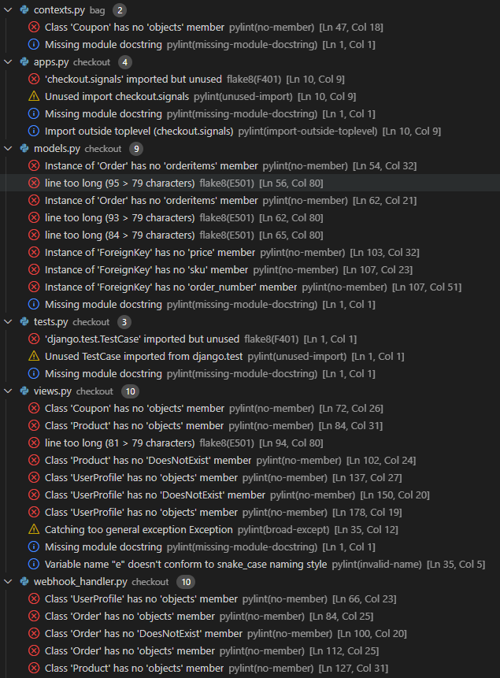

# Manual Testing

[Back to main README](README.md)

### EPIC | Navigation
- As a User I can navigate around the site so that I can easily view desired content.

    - The navigation bar is fixed at the top of the screen, meaning it is always seen by the user, allowing the user to navigate through the content easily & intuitively. Each nav link is named with an obvious link to the page content, for the shop and admin links there are dropdowns for subsections of the website so that there isn't too much information in the navbar.
    - I have tested that the navbar is fully responsive on all screen sizes and remains at the top of each page.
    

    - Also located in the footer are quick links, which has links to all pages of the website.
    

    - I have added a back to top button that appears when the user scrolls down any of the pages, enabling them to quickly navigate back to the top without having to scroll.
    - I have tested that the scroll button works and is responsive.
    

- As a User, I can view a list of products so that I can choose what products to purchase.
    - From the navbar, users can click the 'Shop' link and in the dropdown menu choose 'All Products' to be taken to the product's page, which will list every product on the store.

    

- As a User, I can click on a product to see its details so that I can view the description, price etc.
    - By clicking the product's image, the user is taken directly to the product's detail page, where the name, description, size, composition, quantity and price are displayed.
    

- As a user, I can easily identify different product categories so that I can quickly view the type of products I'm looking for.
    - From the navbar, users can click the 'Shop' link and in the dropdown and choose any category they want to view which will show a product's page, that will list every product on the store under that category.
    - From the home page, users can also find the 'Essentials' section where four featured categories are listed. Clicking either of these images takes the user to the products page, showing only items in that category.
    

- As a User I can search for products so that I can find specific products.
    - Located in the center of the navbar is a search bar. On smaller screens, the search bar is in the hamburger menu. Any searched word will match itself to any text in the product's title, or description and display the results on the product's page.
    

- As a User, I can sort the products so that I can easily find products based on price, category, or title.
    - A sort selector box is located on the products page where users can sort all products by price.
    

- As a User I can add items to my Wishlist so that I can save them for later.
    - Liked products will appear in the user's wishlist items list, located on the user's profile page.
    

### EPIC | Accounts
- As a User, I can register for an account so that I can use the features given to members.
    - Users can click the 'Sign in/up' accounts icon located in the header of the page, and from there click the link 'Register'.
Once on the registration page, users can fill in a short form to sign up for a Lowkey account.
    

- As a User, I can receive a confirmation email when creating an account so that I know the registration was successful.
    - Once the registration form has been submitted, the user will be sent a confirmation email which contains a link that the user has to follow to confirm their account.
    

- As a User I can log in and out of my account so that I can control and manage my account
    - Once a user has created an account they can log-in using the profile icon in the navbar.
    

- As a User, I can recover my password in case I forget it so that I can regain access to my account.
    - If a user forgets their password they can click the link in the login page to recieve an email so that they can create a new password.
    

- As a User, I can view my previous orders so that I can keep a record of what purchases I've made.
    - Once a user has created an account and placed an order, they can view their order's in their profile section located under the accounts menu.
Clicking the user's order number will take you to a summary page of that order.
    

- As a User, I can save my delivery information so that I do not have to refill it out for future orders.
    - Users can fill in their delivery information on their profile page. This information will autofill the checkout form when the user checkouts.
    - When placing an order a checkbox under the delivery information can be checked to save the information added to the form.
    

### EPIC | Admin
- As an Admin, I can add products so that I can update the site's inventory.
    - Admins can navigate to the 'Manage' page under the accounts menu.
    - Once on the product management page the admin can add new products by filling out the 'add product form'.
    

- As an Admin, I can edit a product so that I can keep the products information up to date.
    - If an admin is logged in, the edit button will be displayed in the product detail page.
    - When the 'Edit' button is clicked the admin is taken to the 'Edit product' page. The admin can then edit existing products using the 'edit product form'.
    

- As an Admin, I can delete a product so that I can remove products no longer available.
    - If an admin is logged in, the delete button will be displayed in the product detail page.
    - When the 'delete' button is clicked a confirmation model is diplayed asking the admin if they want to delete the specific product.
    - If the admin wants to delete the product they click delete, else if they no longer want to delete the product they can press the 'cancel' button or click outside of the modal to exit the confirmation modal.
    

- As an admin, I can add coupon codes so that I can offer discounts to my customers.
    - Admins can navigate to the 'Coupon' page under the accounts menu.
    - Once on the coupon management page the admin can add new coupons by filling out the 'add coupon form'.
    

### EPIC | Purchasing
- As a User, I can add items to my basket in varying quantities so that I can keep the items in my basket until I'm ready to buy.
    - On the product's detail page, shoppers can adjust the quantity by using the quantity selector, or by typing in the amount and clicking the 'Add to bag' button, to add the item to the bag.
    - At the bottom of the products card, is an 'Add to Bag' button which adds 1 item to the bag by default.
    

- As a User, I can view my bag so that I can see the total cost of the transaction and the items I will be purchasing.
    - Clicking the bag icon in the top right corner will take the user to their bag.
    - The shopping bag page lists the items added by the user, along with the subtotal of each item, delivery costs, and the total to pay.
    

- As a User, I can always see a running subtotal so that I know how much I'm spending.
    - The bag icon will update automatically to reflect how many items are in the bag.
    - The user will also get success toast messages for every product they add to their bag which displays the bag items, quantity, size and bag total.
    

- As a User, I can easily enter my payment details so that I can checkout quickly with no problems.
    - Paying for items is simple as the user enters their card details into the payment box on the checkout page and click the 'Complete Order' button.
    

- As a User, I can view confirmation of my purchases so that I know the order was received and can review what I've purchased.
    - After an order has been completed, the user will be taken to a confirmation page with a summary of the order.
    - Users will also recieve a confirmation email of their order.
    

- As a User I can apply promotional codes so that I can receive a discount on my purchase.
    - Users can use coupon codes to take off a certain percent of their order.
     

### EPIC | Interaction
- As a User I can add items to my Wishlist so that I can save them for later.
    - Users can click a 'Add to Wishlist' heart button, which is on the upper right corner of the product image on the product's detail page.
    - Clicking the heart will add the product to the users wishlist and fill in the heart. Otherwise, if the product is already liked and the user unlikes it then the product will be removed from the users wishlist and the filled in heart will become empty.
    

- As a User I can sign up for a newsletter to receive up to date information regarding items for sale and discounts.
    - In the footer is a 'Newsletter' section, where the user can input their email address to sign up.
    

- As a User, I can connect to the site's social media pages so that I can follow them and keep up to date with their products and promotions.
    - Users can connect with Lowkey Menswear by following their social media pages using the links found in the footer.
    

- As a User, I can contact the business so that I can find out any information that I require.
    - Users can directly contact Lowkey Menswear via email which is provided in the footer
    

### EPIC | Marketing
- As an Admin I conducted research and implemented SEO keywords to increase traffic to my website.
    - I have implemented SEO by using short and long tail keywords in the head of the website.

- As an Admin I have created a Facebook shop page to increase traffic to my website.
    - I have created a facebook page to increase traffic to my website. A link to the Lowkey Menswear Facebook page is in the websites footer.

## Feature Testing

### Navigation Bar

- #### Links
    Tested:
    - The links change colour when hovered over.
    - The link to the current page is highlighted by bolder font.
    - The Shop link drops down into a sub-menu displaying new arrivals and all product categories.
    - The links collapse into a hamburger menu once the screen size becomes too small. 

    

- ### Search Bar
    Tested:
    - The search bar will search both the product's title and description for a match.
    - On smaller screens, the search bar is in the hamburger menu.

    

- #### Account
    Tested:
    - Hovering over the account icon changes its colour.
    - Clicking the account icon opens a dropdown menu with options for the user to register or sign in.
    - If a user is signed in the dropdown options change to 'My Profile' and 'Logout'.
    - If the super user is signed in then two more options of 'Product' and 'Coupon' are displayed. 

    

- #### Bag Icon
    Tested:
    - When a product is added to the bag, a number displaying the total quantity of items appears, located at the top right of the bag icon.
    - Clicking the bag icon navigates the user to the shopping bag page which displays a summary of what's been added.

    

### Home Page
    
- #### Hero Image
    Tested:
    - The button labelled 'Shop Now' takes the user to the products page.
    - The image changes depending on the size of the screen.

    

- #### Essentials
    Tested:
    - Clicking one of the categories takes the user to the page displaying only products from that category. 
    - Tested that on smaller screen sizes the cards turn into a card carousel so users can swipe through them.

    

- #### Footer
    Tested:
    - All the links change colour when hovered over.
    - All the links in the Quick Links section work.
    - Clicking the social media links takes you to the relevant website.
    - The Newsletter section has an option to input your email and sign up for the weekly newsletter.

    

### Accounts

- #### Register Page
    Tested:
    - Submitting the registration form sends an authentication link to the email provided.
    - Clicking the confirmation link confirms the account.
    - After creating an account the user can use their details to sign in. 

    

- #### Login Page
    Tested:
    - The login page can be used to log in users with an existing account.
    - Users can sign in with either their username or their email address.
    - Toast messages inform the user of their status.
    - The 'Forgot Password' link enables the user to recover their password.
    - When logged in the account dropdown menu turns from 'Sign in/up' to 'My Profile' and 'Log Out'.

    

- #### Log out Page
    Tested:
    - The logout page logs out users who are signed in.
    - The account icon label turns from 'My Profile' and 'Log Out' to 'Sign in/up'.
    - Toast messages inform the user of their status.

    

### Profile

- #### Delivery Details
    Tested:
    - The delivery details section stores the user's delivery address and phone number.
    - The saved delivery details auto-fill the delivery form at the checkout.
    - A toast message informs the user that the delivery details have been updated.

    
   
- #### Order History
    Tested:
    - The table displays the order number, date it was ordered, items ordered, item size, quantities of the items and the order total.
    - Clicking the order number will take the user to the orders detail page/order success page.
    - Hovering over the truncated order number reveals the whole order number.
    - The order summary page has a button to take the user back to their profile page. 
    - The order history shows the five most recent orders.

    

- #### Wishlist Items
    Tested:
    - The Wishlist items section keeps a list of all products that the user has liked.

    

### All Products

- #### Page Heading
    Tested:
    - That each page heading is unique based on the category selected.
    

- #### Sorting
    Tested:
    - Clicking the box opens up a dropdown menu with the price options on how to sort the products.
    - Clicking each option sorts the products in the way described.

    

- #### Products
    Tested:
    - The products page is fully responsive, adjusting how many products are on each row depending on the screen size.
    - Each product card shows an image of the product, its name and price.
    - An 'Add to Bag' button can be used to add the item to the bag.
    - Any products that have been liked by the user displays a red heart in the top right corner. 
    - If the user is a superuser, the admin buttons 'Edit' and 'Delete' will be displayed beneath the 'Add to Bag' button.

    

### Products Details

- #### Product Information
    Tested:
    - The product information section shows information about the product and buttons to add the item to the bag in multiple quantities.
    - Users can select the size of the product, and only select 5 of each size of an item.
    - If the user is a superuser, the admin buttons 'Edit' and 'Delete' will be displayed beneath the 'Add to Bag' button.

    

- #### Like Button
    Tested:
    - The heart button renders as empty if either the user is signed out or the product is not liked by the user.
    - Liking a product fills in the heart and adds the product to the user's wishlist on their profile page.
    - Unliking a product unfills the heart and removes the product from the user's wishlist on their profile page.
    - A toast message informs the user when a product has been added or removed from their wishlist.
    - If the heart is clicked when a user is not signed in, an 'Account Required' modal pops up informing the user that they need to either sign in or create an account to use that feature.

    

- #### Quantity Buttons
    Tested:
    - The up and down arrow buttons increase and decrease the quantity. 
    - If the value is set to 1 the down arrow quantity will be disabled. Respectively if the value is set to 5 the up arrow button is disabled.
    - Clicking the 'Add to Bag' button takes the number in the input field and adds that amount of products to the bag.
    - Trying to add an amount less than one or above five, renders an error message informing the user of the parameters needed to be successful.
    - Clicking the 'Add to Bag' button adds one item to the bag by default. 

    

### Product Management

- #### Add Product
    Tested:
    - The add product page is accessed by the account dropdown menu, under product.
    - If the form is submitted with any of the fields left blank then an error message appears above that particular field, notifying the user of the issue.
    - An error message appears if an already existing SKU is attempted.
    - If a price is added with more than 6 digits the form fails and an error message appears under the price field.
    - If no image is chosen the default image is used.
    - The superuser can also see which users have liked the product.
    - Clicking the 'Add Product' button at the bottom of the form creates the product.
    - A toast message informs the user if the product is added successfully.

    

- #### Edit Product
    Tested:
    - The Edit Product page can be accessed from the 'Edit' button under the 'Add to Bag' button on the product's detail page.
    - Clicking the edit button takes the user to the edit product page where the information is already autofilled with the specific product information.
    - The image field displays a thumbnail of the current image and has a checkbox option to remove it. Checking this will change the image to the default image.
    - Clicking the 'Edit Product' button saves any changes made to the existing product.  

    

- #### Delete Product
    Tested:
    - The delete product page can be accessed from by the 'Delete' button under the 'Add to Bag' button on the product's detail page.
    - Clicking the delete button displays a warning modal, asking the superuser if they are sure they want to delete the product, and informing them that it cannot be undone. 
    - Once the warning modal has been activated, the delete button deletes the product from the database. 
    - Pressing the cancel button or clicking outside of the model closes the confirmation modal.
    - A toast message appears, informing the user that the product has been deleted.

    

- #### Add Coupon
    Tested:
    - The add coupon page is accessed by the account dropdown menu, under coupon.
    - The form lists all the necessary fields to create a new coupon. 
    - The user must fill out all fields with an Asterix. If the form is submitted with any of these fields left empty then an error message will appear above that specific field, notifying the user of the issue.
    - The Discount code field must be unique. An error message will appear if an already existing discount code is attempted.
    - If a discount percentage is added that is less than 0 or greater than 100 the form will fail and an error message will appear under the field.
    - Clicking the 'Add Coupon' button at the bottom of the form will create the coupon if the form is valid.
    
    

### Bag

- #### Items
    Tested:
    - The bag page displays all items that the user has added to it. 
    - The page lists the items added, displaying it's image, followed by it's title and SKU.
    - Adding an item to the bag triggers a toast message informing the user of their actions.

     

- #### Quantity and Price
    Tested:
    - The quantity element has buttons either side and increases or decreases the total.
    - The minus quantity button will be disabled if the quantity of the item is one. Respectively the plus button will also be disabled if the quantity of the item is 5.
    - Clicking the 'Update' button saves any changes to the quantity and updates the item's subtotal.
    - Clicking the 'Remove' button removes the item completely from the user's bag. 
    - Manually inputting the number zero or anything below and clicking 'Update' will remove the item from the bag. 
    - Manually inputting a number above 5 and clicking 'Update' will result in an error message informing the user of the correct parameters. 

    
    
- #### Totals and messaging
    Tested: 
    - The checkout button takes the user to the checkout.
    - The 'Continue Shopping' link takes users back to the store.

    

- #### Coupons
    Tested:
    - Above the subtotal is an input box where users can enter a coupon/promo code.
    - If the coupon code entered is valid, a success toast message will pop and a summary of the coupon added, and the discount given will appear in the summary of the costs.
    - If the coupon code entered is invalid, an error toast message will pop, and the totals will not change.

    

### Checkout

- #### Details
    Tested:
    - If the user is anonymous, a link to create an account or login will be displayed at the bottom of the checkout form.
    - If the user is signed in a checkbox to save the delivery information can be checked, and if checked the information is saved.
    - If the user is signed in and has delivery information saved, the delivery details and email address are automatically filled in. 

    

    - Any field with an Asterix is required. If a user tries to complete the form with any of these fields left blank the affected field is highlighted.  

    

- #### Order Summary
    Tested:
    - Clicking the image of any items in the summary takes the user to that product's detail page.
    - This section lists all the items about to be purchased, along with the name, size, quantity, subtotal and total.
    - Next to the order summary title will be a number reflecting the total number of items that appear in the order.

    

- #### Payment
    Tested:
    - Only numbers can be entered into the card payment box. Incorrect card numbers automatically show an invalid card number error.
    - The site can be tested by using the dummy card number 4242 4242 4242 4242 with the expiry date 04/24 and the CVC code 242.
    - At the end of the page is a button to complete the order or to return back to the bag. 
    - There is a warning message informing the user of how much their card is about to be charged.

    

- #### Loading Spinner
    Tested:
    - Upon clicking the complete order button, as long as the form is valid, a loading spinner is displayed until the information is processed.

     
    
- #### Confirmation
    Tested: 
    - Once the order has been processed the user is taken to the checkout success page. 
    - A confirmation email is also sent to the email address provided, and this is noted at the top of the page. 
    - At the end of the summary is a button that the user can click to take them back to the main shop.

    

- #### Webhooks
    Tested:
    - Once an order is placed, a webhook will search the database to confirm the order exists. 
    - If it cannot find the original order, it will create one using the information provided by the user in the original instance.

    

### Other

- #### Scroll To Top Button
    Tested:
    - On large screens, once the user has scrolled past a certain point, an arrow will appear at the bottom, right side of the screen.
    - Clicking the arrow scrolls the user back to the top of the page. 
    
    

- #### Toasts
    Tested:
    - Toasts appear in the top right-hand corner of the display informing the user of any actions they have performed.

    

- #### 404 page
    Tested:
    - If any links are broken or the user types in an address that doesn't exist, a 404 error page will be displayed.

    

- #### Newsletter 
    Tested:
    - Signing up to the newsletter registers the email given to [Mailchimp](https://mailchimp.com/en-gb/).

    

- #### Responsiveness 
    Tested:
    - Every page on the site is fully responsive.

    

## Validators

### HTML

- All Pages were checked with the official [W3C validator](https://validator.w3.org/). 

#### Home Page validation 

### CSS

- All CSS was checked with the official [Jigsaw validator](https://jigsaw.w3.org/css-validator/). 

#### Base CSS

#### Checkout CSS

### JSHINT

- All Javascript was passed through [Jshint](https://jshint.com/).

### Base

### Products

### Bag

### Quantity Buttons
- Errors due to 'template literal syntax'

### Checkout - Stripe

### Scroll Arrow

### PEP8

- Flake8 only shows the type of errors that can be ignored as they are due to unrecognised syntax. At the time of testing PEP8 online was not availabe due to an expired domain.

### Lighthouse

- Lighthouse reported great in all areas.

